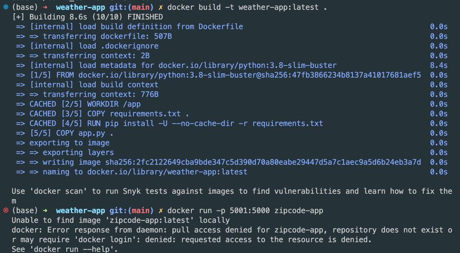
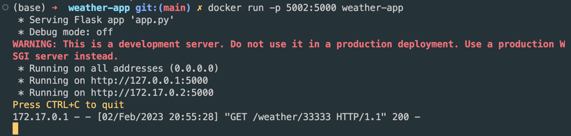
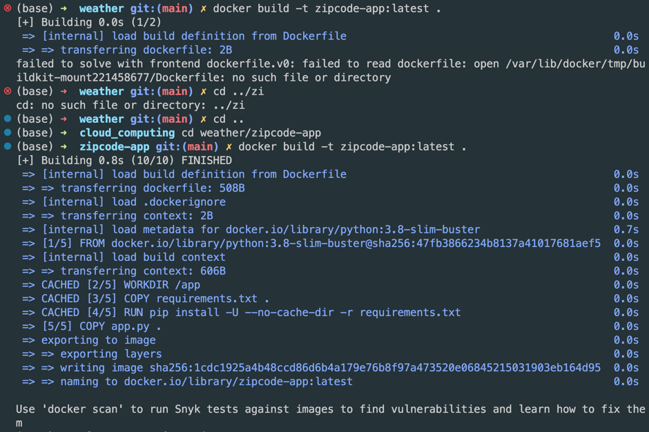
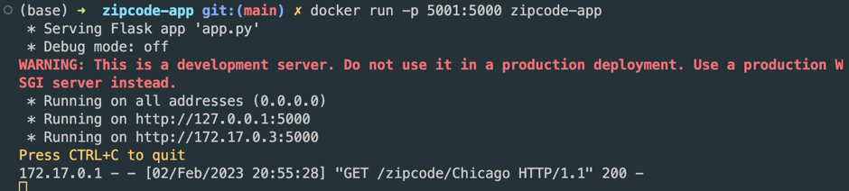
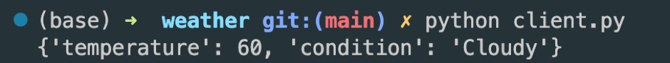

# Zipcode Microservice

This microservice returns the zipcode for a given area.

## Getting Started

These instructions will get you a copy of the project up and running on your local machine for development and testing purposes.


### Installing

Clone the repository:
    
    ```bash
    git clone https://github.com/peng-shan/zipcode-app.git
    ```

Build the docker image:
    
    ```bash
    cd zipcode-app
    docker build -t zipcode-app .
    ```

Run the docker container:
    
    ```bash
    docker run -p 5001:5000 zipcode-app
    ```

# Weather Microservice

This microservice returns the weather for a given zipcode.

## Getting Started

These instructions will get you a copy of the project up and running on your local machine for development and testing purposes.


### Installing

Clone the repository:
    
    ```bash
    git clone https://github.com/peng-shan/weather-app.git
    ```

Build the docker image:
    
    ```bash
    cd weather-app
    docker build -t weather-app .
    ```

Run the docker container:
    
    ```bash
    docker run -p 5002:5000 weather-app
    ```

#Integration - connect two services

client.py is a simple client that integrates the two microservices. It takes a zipcode as input and returns the weather for that zipcode.

##Running the client

    ```bash
    python client.py
    ```

## Output

### build images and run containers






### run client.py



